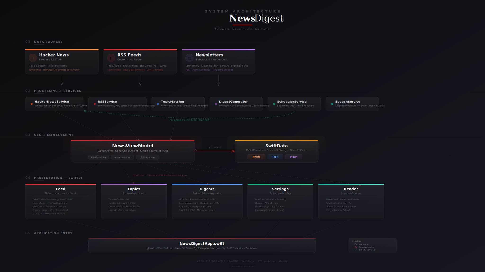

# NewsDigest — AI News Curator for Mac

A native macOS app that automatically curates the most interesting tech news 24/7, ranking articles from Hacker News, RSS feeds, and Substack newsletters based on your personal topics of interest. Read articles in-app, listen to podcast-style audio digests, or export editorial markdown reports.

**Author:** Binh Phan

## Architecture

<p align="center">
  
</p>

## Quick Start — Build & Install

```bash
# One command: build app + create DMG installer
make

# Or step by step:
make build          # Compile the app
make dmg            # Build + package as DMG
make run            # Build and launch immediately
make open           # Open in Xcode
make clean          # Remove build artifacts
```

The DMG will be at `build/NewsDigest.dmg`. Double-click it, drag NewsDigest to Applications, done.

### Prerequisites

- macOS 14.0 (Sonoma) or later
- Xcode 15.0 or later (install from App Store or [developer.apple.com](https://developer.apple.com/xcode/))

## Features

### News Curation
- **24/7 Auto-Fetching** — Background scheduler fetches news every hour (configurable: 30 min to 6 hours)
- **Multiple Sources** — Hacker News top stories, 5 major RSS feeds (TechCrunch, Ars Technica, The Verge, MIT Tech Review, Wired), 5 top newsletters (Stratechery, Simon Willison, Astral Codex Ten, Lenny's Newsletter, The Pragmatic Engineer)
- **Topic-Based Curation** — Define topics with keywords; matching articles get boosted and tagged
- **Smart Ranking** — Composite score from HN engagement, topic relevance, source quality, and recency

### Reading Experience
- **Flipboard-Inspired UI** — Magazine-style card layout with hero cards, editorial pairs, and wide cards in alternating patterns
- **In-App Reader** — Read articles directly inside the app via embedded WebView
- **Article Audio** — Click "Listen" on any article to hear it read aloud with a premium human-like voice. Extracts article text via JavaScript and narrates with pause/resume controls

### Audio Digests
- **Podcast-Style Narration** — NotebookLM-inspired conversational scripts with color commentary, contextual leads, and thematic segments
- **Premium Voices** — Automatically selects the best available macOS voice (Premium > Enhanced > Default)
- **Playback Controls** — Play, pause, resume, stop with real-time progress tracking

### System Integration
- **Background Running** — App keeps running when the window is closed, fetching news on schedule
- **Menu Bar** — Quick access dropdown with top 7 stories, refresh, navigation shortcuts, restart, and quit
- **macOS Notifications** — Alerts when new articles arrive
- **Bookmarks** — Save articles; bookmarked ones are protected from auto-cleanup

## Design

The UI follows Flipboard's magazine-style design language:

- **Typography** — Serif headlines (New York) with heavy/light weight contrast, tracked uppercase metadata labels
- **Card Layout** — Cover cards with gradient banners, editorial half-width pairs, wide cards with accent bars
- **Color System** — Flipboard red (#E12828) primary accent, source-colored indicators (orange HN, purple Substack, red RSS)
- **Interactions** — Hover-lift animations with shadow deepening, smooth 150ms transitions
- **Sidebar** — Frosted vibrancy background, red accent stripe on active item

## How It Works

### News Fetching
- **Hacker News**: Fetches top 60 story IDs, loads in parallel via `TaskGroup` (10 concurrent max)
- **RSS/Atom**: Custom lightweight XML parser — no third-party dependencies. Handles CDATA, HTML entities, and multiple date formats
- **Deduplication**: `Set<URL>` — O(1) lookups during fetch

### Ranking Algorithm
| Factor | Points |
|---|---|
| HN points | 1× |
| HN comments | 2× |
| Topic match | +50 |
| Newsletter source | +30 |
| Published < 6 hours ago | +20 |
| Published < 24 hours ago | +10 |

### Podcast-Style Digest
The digest generator produces NotebookLM-style conversational audio:
- **Thematic segments** — Articles grouped by topic with natural transitions
- **Conversational leads** — Context-aware framing ("Here's a big one", "Now this is spicy")
- **Color commentary** — Topical insights ("The pace of AI change is honestly hard to keep up with")
- **Reframed summaries** — "The gist of it is..." instead of reading verbatim
- **Warm sign-offs** — Varied, natural closing lines

### Performance Optimizations
- **Cached ranked articles** — Sorted once per data load, not on every render
- **Static date formatters** — Created once, reused across all RSS parsing
- **Cached compiled regexes** — `extractTag()` and `cleanHTML()` use pre-compiled patterns
- **Throttled HN requests** — 10 concurrent max instead of 60 simultaneous
- **Single `.sheet` per list** — One sheet modifier on the parent, not per row
- **Dictionary lookup** — O(1) article lookup for digests

## Project Structure

```
NewsDigest/
├── NewsDigestApp.swift          # App entry, WindowGroup + MenuBarExtra + AppDelegate
├── Models/
│   ├── Article.swift            # SwiftData model + ranking score
│   ├── Topic.swift              # SwiftData model for topics
│   └── Digest.swift             # SwiftData model for digests
├── Services/
│   ├── HackerNewsService.swift  # HN Firebase API (async/await, bounded TaskGroup)
│   ├── RSSService.swift         # RSS/Atom XML parser (cached regex + formatters)
│   ├── TopicMatcher.swift       # Keyword matching + ranking engine
│   ├── DigestGenerator.swift    # Podcast script + editorial report builder
│   ├── SpeechService.swift      # AVSpeechSynthesizer (premium voice selection)
│   └── SchedulerService.swift   # Background timer + notifications
├── ViewModels/
│   └── NewsViewModel.swift      # @Published state + caching + coordination
├── Views/
│   ├── ContentView.swift        # Sidebar + tab switching + visual effects
│   ├── FeedView.swift           # Magazine grid (Cover/Editorial/Wide cards)
│   ├── TopicsView.swift         # Topic tiles + FlowLayout keywords
│   ├── DigestsView.swift        # Split list/detail + audio controls
│   ├── SettingsView.swift       # Schedule, storage, sources, about
│   ├── ArticleReaderView.swift  # WKWebView + text-to-speech extraction
│   └── MenuBarView.swift        # Menu bar dropdown (quick actions)
├── scripts/
│   ├── build-dmg.sh             # Full build + DMG (standalone)
│   ├── create-dmg.sh            # DMG packager
│   └── dmg-background.png       # DMG installer background
├── docs/
│   └── architecture.svg         # Architecture diagram
└── Makefile                     # One-command build system
```

## Customization

### Adding RSS/Substack Feeds
Edit `Services/RSSService.swift` → `defaultFeeds`:
```swift
FeedSource(name: "Your Feed", url: "https://example.com/feed/", type: .rss)
```

### Adding Topics
Use the Topics tab in the app, or edit `seedDefaultTopics()` in `ViewModels/NewsViewModel.swift`.

### Installing Premium Voices
For the best listening experience, install premium voices:
1. **System Settings** → **Accessibility** → **Spoken Content**
2. **System Voice** → **Manage Voices**
3. Download: Zoe (Premium), Ava (Premium), Tom (Premium), or Evan (Premium)

The app automatically selects the highest quality voice available.

## Zero Dependencies

Pure Apple frameworks — SwiftUI, SwiftData, WebKit, AVFoundation, UserNotifications, Foundation. No CocoaPods, no SPM packages, no API keys.
